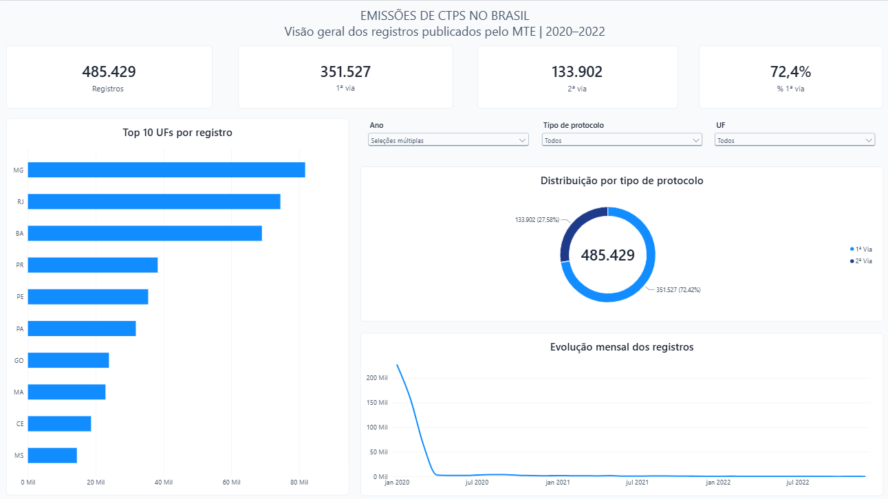
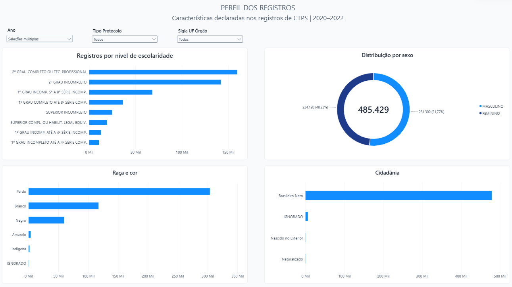
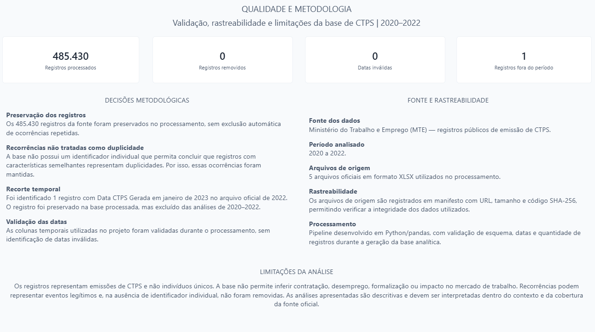
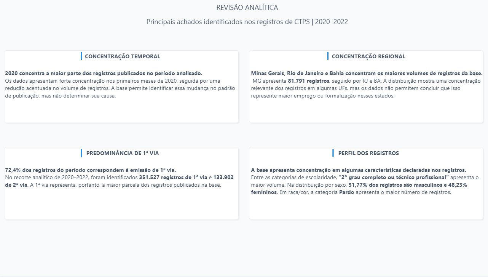

# Emissões de CTPS no Brasil — 2020 a 2022

Análise de registros públicos de emissão de Carteira de Trabalho e Previdência Social, com pipeline em Python, consultas SQL e dashboard interativo desenvolvido no Power BI Desktop.

O objetivo é entender a distribuição dos registros por período, UF do órgão emissor, tipo de protocolo e características declaradas, verificando a qualidade da fonte antes de interpretar os resultados.

**485.430 registros processados e preservados. O recorte analítico de 2020–2022 contém 485.429.** A diferença é um registro de janeiro de 2023 presente no arquivo oficial de 2022: ele permanece na base e no relatório de qualidade, mas não entra nas análises desse período.

## Principais resultados

Valores calculados no recorte de 2020–2022, sem outros filtros:

- **1ª via:** 351.527 registros (**72,4%**); **2ª via:** 133.902 (**27,6%**).
- **MG, RJ e BA** apresentam os maiores volumes: 81.791, 74.476 e 69.040 registros. As cinco categorias de UF líderes concentram **61,6%** do total.
- **2020 concentra 470.560 registros (96,9%)**. O pico mensal foi janeiro de 2020, com 227.013; dezembro de 2022 teve 62. A base mostra a redução do volume publicado, sem explicar sua causa.
- A categoria de escolaridade mais frequente é **“2º GRAU COMPLETO OU TEC. PROFISSIONAL”**, com 159.537 registros. Em sexo, são 251.309 masculinos (**51,77%**) e 234.120 femininos (**48,23%**). Em raça/cor, **Pardo** tem o maior volume, com 303.672 registros.
- Em cidadania, **Brasileiro Nato** reúne 478.832 registros. As demais categorias originais, inclusive “IGNORADO”, são preservadas.

Os números vêm das [tabelas geradas](reports/tables/) e dos [insights calculados pelo pipeline](reports/insights.md). Concentração de registros não equivale a maior emprego ou formalização.

## Dashboard Power BI

O arquivo [dashboard_ctps_2020_2022.pbix](powerbi/dashboard_ctps_2020_2022.pbix) contém o dashboard completo e interativo, construído manualmente no Power BI Desktop. As capturas abaixo são as imagens originais das quatro páginas.

### 1. Visão Geral

Volume, 1ª e 2ª via, participação de 1ª via, Top 10 UFs, evolução mensal e filtros de ano, protocolo e UF. A captura mostra os anos 2020, 2021 e 2022 selecionados.



<details>
<summary>2. Perfil dos Registros</summary>

Escolaridade, sexo, raça/cor e cidadania.

A página está salva com **2020, 2021 e 2022 selecionados**, exibindo **485.429 registros**: 251.309 masculinos (51,77%) e 234.120 femininos (48,23%). O PBIX e a captura fornecidos pelo autor foram copiados sem edição e estão alinhados ao recorte analítico deste README.



</details>

<details>
<summary>3. Qualidade e Metodologia</summary>

Base completa: registros processados, removidos, datas inválidas, ocorrência fora do período e limites de interpretação.



</details>

<details>
<summary>4. Revisão Analítica</summary>

Síntese descritiva da concentração temporal e regional, do tipo de protocolo e do perfil dos registros.



</details>

A [documentação das páginas](powerbi/dashboard_spec.md) detalha os filtros e a reconciliação das capturas. O [modelo e as instruções de carregamento](powerbi/modelo.md) explicam como conectar o dashboard ao CSV em outro computador.

## Metodologia e qualidade

`Dados públicos → Python/pandas → validação → CSV e SQLite → análise SQL → Power BI → interpretação`

1. Verificação dos cinco arquivos XLSX por URL, tamanho e SHA-256 do [manifesto](data/source_manifest.json).
2. Validação do esquema em cada arquivo; tratamento de espaços nas extremidades e conversão explícita das datas mensais. Datas inválidas interrompem a execução.
3. Preservação de todas as linhas no CSV e no SQLite. As agregações e os gráficos usam apenas `Data CTPS Gerada` entre janeiro de 2020 e dezembro de 2022.
4. Geração de tabelas, gráficos, insights e relatório de qualidade com rastreabilidade por arquivo de origem.

**Repetições de registros:** 25.844 linhas excedentes após a primeira ocorrência de cada combinação das 18 colunas de negócio, na base completa. Não são pessoas nem combinações únicas, e nenhuma linha foi removida. A definição e as colunas estão no [modelo](powerbi/modelo.md).

**UF não padronizada:** a categoria original `IG` aparece em 12 registros. Foi preservada, sem substituição por uma UF presumida. Sua origem e o registro de 2023 estão documentados em [qualidade e reconciliação](reports/qualidade.md).

## Tecnologias e organização

Python, pandas, openpyxl, matplotlib, SQL/SQLite, Power BI, Power Query e DAX.

- [src/ctps_pipeline.py](src/ctps_pipeline.py): processamento, validação e agregações.
- [sql/analises.sql](sql/analises.sql): consultas no recorte e métrica de repetições.
- [reports/](reports/): tabelas, gráficos e análises reproduzíveis.
- [powerbi/](powerbi/): PBIX, capturas e documentação técnica de apoio.
- [tests/](tests/): testes unitários e integração com fontes locais.

## Como reproduzir

Python 3.11 ou superior. No PowerShell, a partir da raiz do projeto:

```powershell
python -m venv .venv
.\.venv\Scripts\Activate.ps1
pip install -r requirements.txt
python scripts/download_source.py
python -m src.ctps_pipeline --source-dir data/raw --output-dir data/processed
python -m pytest -m "not integration"
$env:CTPS_SOURCE_DIR = "data/raw"
python -m pytest -m integration
```

O pipeline gera `data/processed/ctps_emissoes.csv`, o SQLite, `quality_report.json` e os outputs em `reports/`. A base completa alimenta o Power BI; os filtros definem o recorte analítico. Para atualizar os dados no Desktop, siga [as instruções do modelo](powerbi/modelo.md).

A integração compara CSV e SQLite, consultas SQL e tabelas, além de conferir a reprodução dos relatórios e gráficos. A CI executa somente os testes unitários, sem baixar os arquivos oficiais. Dados brutos e bases processadas não são versionados; o PBIX contém a base importada necessária à inspeção do dashboard.

## Limitações e fonte

Os registros representam emissões, não necessariamente indivíduos únicos. Recorrências podem ser legítimas; a ausência de identificador individual impede classificá-las automaticamente como duplicidades. As datas têm granularidade mensal; a UF é a do órgão emissor, não necessariamente a residência.

A análise é descritiva e limitada à cobertura da publicação oficial. Não mede contratação, desemprego, formalização ou impacto econômico, nem sustenta conclusões causais.

**Fonte:** Ministério do Trabalho e Emprego — [estatísticas da CTPS](https://www.gov.br/trabalho-e-emprego/pt-br/servicos/trabalhador/carteira-de-trabalho/estatisticas). Arquivos, URLs e hashes estão no [manifesto das fontes](data/source_manifest.json).
