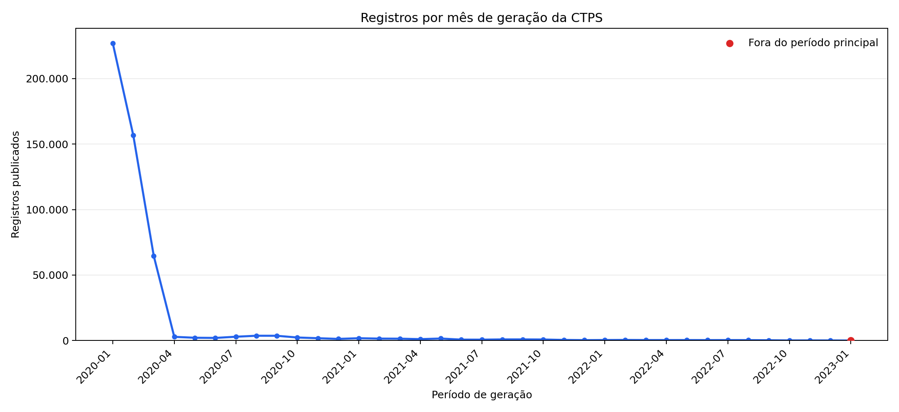
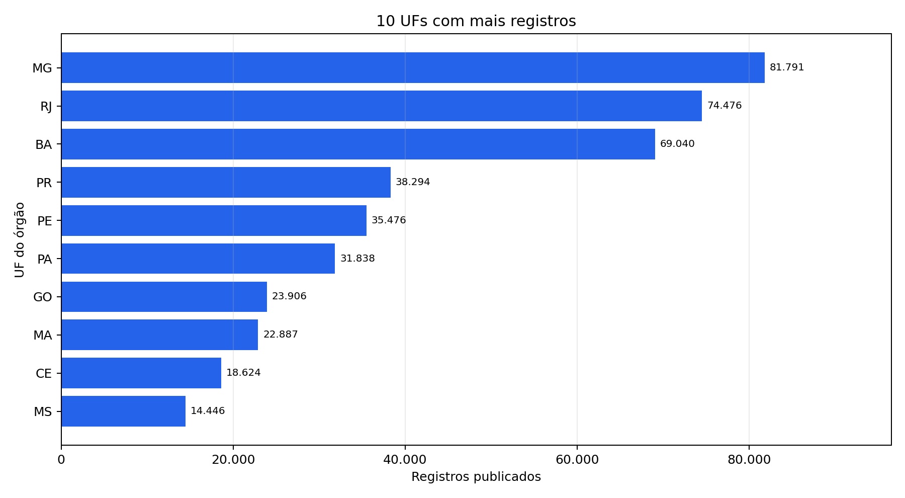

# Emissões de CTPS no Brasil — 2020 a 2022

Análise descritiva e reproduzível dos registros públicos de emissão de Carteira de Trabalho e Previdência Social (CTPS), publicada pelo Ministério do Trabalho e Emprego (MTE).

## Visão geral

O projeto examina como os registros publicados se distribuem por mês, UF e tipo de protocolo. O fluxo permite conferir a qualidade dos dados e acompanhar a composição do volume registrado.

- **Fonte:** [estatísticas oficiais da CTPS](https://www.gov.br/trabalho-e-emprego/pt-br/servicos/trabalhador/carteira-de-trabalho/estatisticas)
- **Período principal:** `Data CTPS Gerada` entre `2020-01` e `2022-12`
- **Registros preservados:** 485.430, sem remoção de linhas repetidas
- **Tecnologias:** Python, pandas, matplotlib, SQLite, SQL e especificação de Power BI

## Principais resultados

Os valores abaixo são calculados pelo pipeline e podem ser conferidos em [`reports/insights.md`](reports/insights.md) e nas tabelas geradas. Totais e participações incluem todos os arquivos, inclusive a ocorrência de janeiro de 2023.

- Foram preservados **485.430 registros** dos cinco arquivos oficiais.
- **1ª Via:** 351.527 registros (**72,4%**); **2ª Via:** 133.903 (**27,6%**).
- **MG** foi a UF com maior volume, com 81.791 registros (**16,8%**); as cinco UFs líderes somam 299.077 (**61,6%**).
- O maior volume mensal ocorreu em **2020-01**, com 227.013 registros; em **2022-12** foram observados 62.
- Existe **1 registro com `Data CTPS Gerada = 2023-01`** na fonte `dados_ctps_2022.xlsx`. Ele foi preservado e sinalizado como fora do período principal.

## Visualizações

### Evolução mensal



### Distribuição por UF



## Pipeline

```text
Fonte oficial
    ↓
Download e manifest SHA-256
    ↓
Validação de arquivos e esquema
    ↓
Transformação com pandas
    ↓
CSV processado e SQLite
    ↓
Consultas SQL e agregações
    ↓
Tabelas, gráficos e insights
    ↓
Especificação para Power BI
```

O código principal está em [`src/ctps_pipeline.py`](src/ctps_pipeline.py). As consultas analíticas estão em [`sql/analises.sql`](sql/analises.sql). O relatório de qualidade fica em `data/processed/quality_report.json` após a execução.

## Decisões metodológicas

- **Registros repetidos:** linhas com o mesmo conjunto de atributos de negócio foram preservadas. A fonte não fornece um identificador de atendimento ou de pessoa que permita classificá-las como duplicatas indevidas.
- **Registro `2023-01`:** o valor existe em `dados_ctps_2022.xlsx`, com protocolo e emissão em `2022-12`. Foi mantido para não alterar a fonte silenciosamente e está detalhado em [`reports/tables/emissoes_fora_intervalo.csv`](reports/tables/emissoes_fora_intervalo.csv).
- **Datas de protocolo:** 15.017 protocolos são anteriores a 2020. Eles representam histórico do atendimento e não são usados para recortar a série principal, baseada em `Data CTPS Gerada`.
- **Interpretação:** emissão de CTPS é um registro administrativo. Não mede contratação, desemprego, pessoas únicas ou causalidade econômica.
- **Arquivos brutos:** não são versionados por tamanho e por serem obtidos de fonte pública; o download é reproduzível pelo manifest e seus hashes.

## Tecnologias

Python 3.11+, pandas, matplotlib, openpyxl, SQLite, SQL e Power BI (Power Query e DAX documentados).

## Como reproduzir

```bash
python -m venv .venv
```

No Windows PowerShell:

```powershell
.\.venv\Scripts\Activate.ps1
pip install -r requirements.txt
python scripts/download_source.py
python -m src.ctps_pipeline --source-dir data/raw --output-dir data/processed
pytest
$env:CTPS_SOURCE_DIR = "data/raw"
pytest -m integration
```

O pipeline gera o CSV e SQLite processados, `quality_report.json`, tabelas agregadas, gráficos e `reports/insights.md`. Os testes unitários ficam em `tests/test_pipeline.py`; o teste de integração usa fontes locais quando `CTPS_SOURCE_DIR` está definido.

## SQL e Power BI

[`sql/analises.sql`](sql/analises.sql) consulta a tabela `ctps_emissoes` no SQLite. Em [`powerbi/`](powerbi/) estão:

- [`PowerQuery.m`](powerbi/PowerQuery.m), para importar e tipar o CSV;
- [`medidas.dax`](powerbi/medidas.dax), com medidas explícitas;
- [`modelo.md`](powerbi/modelo.md) e [`dashboard_spec.md`](powerbi/dashboard_spec.md), com o modelo e as páginas propostas.

Ainda não existe um arquivo `.pbix`. O dashboard real será construído posteriormente no Power BI Desktop; a documentação atual é uma especificação de implementação, não uma entrega concluída.

## Limitações

As datas têm granularidade mensal e os arquivos podem ter diferenças históricas de preenchimento. Não há identificador de pessoa ou atendimento, portanto não é possível medir pessoas únicas ou reincidência. As comparações descrevem os registros publicados pelo MTE e não devem ser usadas como estimativa de emprego, desemprego, tamanho de mercado ou impacto de política pública.
